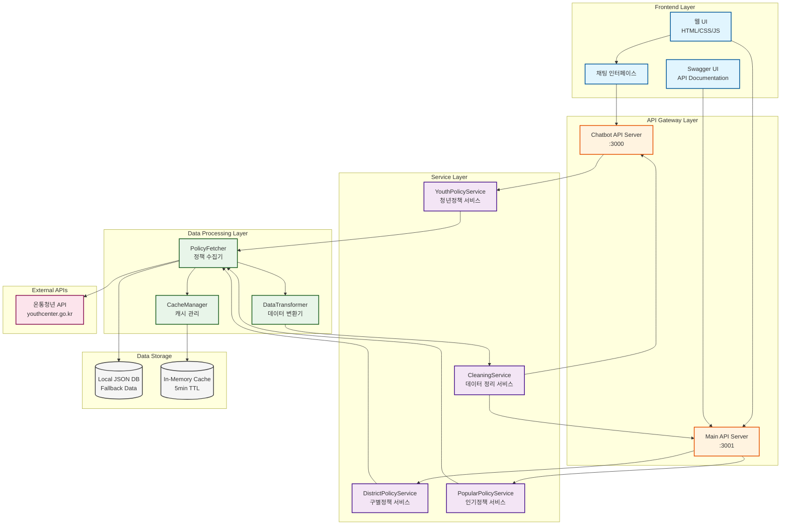
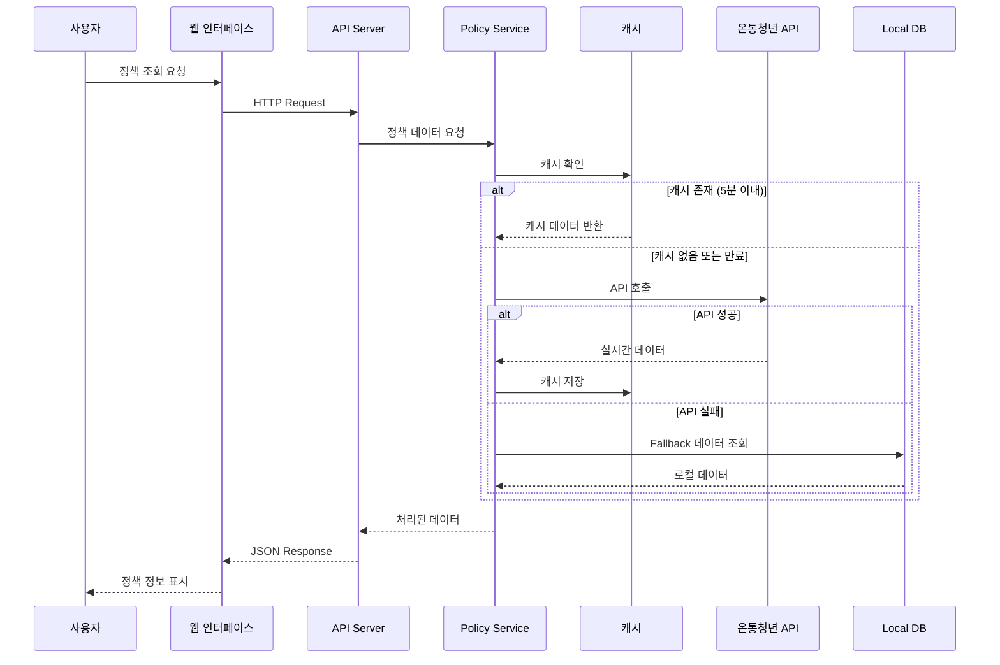

# 🏗️ YOUTHY AI 시스템 아키텍처

## 📊 전체 아키텍처 다이어그램



## 🔄 데이터 흐름도



## 🧩 컴포넌트 상세 구조

### 1. Frontend Layer (프론트엔드 계층)

```
┌─────────────────────────────────────────┐
│           Frontend Layer                 │
├─────────────────────────────────────────┤
│  ┌─────────────┐  ┌─────────────┐      │
│  │   Chat UI   │  │  Swagger UI │      │
│  └─────────────┘  └─────────────┘      │
│  ┌───────────────────────────────┐      │
│  │    Main Web Interface         │      │
│  │  - 정책 검색                  │      │
│  │  - 구별 필터                  │      │
│  │  - TOP 10 표시                │      │
│  └───────────────────────────────┘      │
└─────────────────────────────────────────┘
```

### 2. API Gateway Layer (API 게이트웨이 계층)

```
┌─────────────────────────────────────────┐
│          API Gateway Layer              │
├─────────────────────────────────────────┤
│  ┌─────────────────────────────────┐    │
│  │   Chatbot Server (:3000)        │    │
│  │  POST /api/chat                 │    │
│  │  GET /api/popular-policies      │    │
│  └─────────────────────────────────┘    │
│  ┌─────────────────────────────────┐    │
│  │   District API Server (:3001)   │    │
│  │  GET /api/district-policies     │    │
│  │  GET /api/special-top10         │    │
│  │  GET /api/popular-keywords      │    │
│  └─────────────────────────────────┘    │
└─────────────────────────────────────────┘
```

### 3. Service Layer (서비스 계층)

```
┌─────────────────────────────────────────┐
│           Service Layer                 │
├─────────────────────────────────────────┤
│  ┌─────────────────────────────────┐    │
│  │   YouthPolicyService            │    │
│  │  - analyzeAndRecommend()        │    │
│  │  - getPopularPolicies()         │    │
│  │  - formatPolicyForChat()        │    │
│  └─────────────────────────────────┘    │
│  ┌─────────────────────────────────┐    │
│  │   DistrictPolicyService         │    │
│  │  - fetchFromYouthCenter()       │    │
│  │  - transformPolicy()            │    │
│  │  - calculateDDay()              │    │
│  └─────────────────────────────────┘    │
│  ┌─────────────────────────────────┐    │
│  │   DataCleaningService           │    │
│  │  - cleanDescription()           │    │
│  │  - formatTarget()               │    │
│  │  - parseDate()                  │    │
│  └─────────────────────────────────┘    │
└─────────────────────────────────────────┘
```

### 4. Data Processing Layer (데이터 처리 계층)

```
┌─────────────────────────────────────────┐
│       Data Processing Layer             │
├─────────────────────────────────────────┤
│  ┌─────────────────────────────────┐    │
│  │   Real Policy Fetcher           │    │
│  │  - GET 메서드 사용               │    │
│  │  - result.youthPolicyList 파싱  │    │
│  │  - 에러 핸들링                  │    │
│  └─────────────────────────────────┘    │
│  ┌─────────────────────────────────┐    │
│  │   Data Transformer              │    │
│  │  - plcyExplnCn → description    │    │
│  │  - YYYYMMDD → MM/DD 변환        │    │
│  │  - 'ㅇ' 마커 제거               │    │
│  └─────────────────────────────────┘    │
│  ┌─────────────────────────────────┐    │
│  │   Cache Manager                 │    │
│  │  - 5분 TTL                      │    │
│  │  - In-memory 저장               │    │
│  │  - 구별 키 관리                 │    │
│  └─────────────────────────────────┘    │
└─────────────────────────────────────────┘
```

## 🔌 API 엔드포인트 구조

### Main API Server (Port 3001)
```
/api
├── /district-policies          # 구별 정책 목록
│   └── /:district              # 특정 구 정책
├── /special-top10              # 특수 TOP 10
├── /popular-keywords           # 인기 키워드
├── /trending-policies          # 트렌딩 정책
├── /autocomplete               # 자동완성
├── /statistics                 # 통계
├── /policies                   # 모든 정책
│   ├── /search                 # 정책 검색
│   ├── /field/:field           # 분야별 정책
│   └── /:id                    # 정책 상세
└── /api-docs                   # Swagger 문서
```

### Chatbot Server (Port 3000)
```
/api
├── /chat                       # 채팅 메시지 처리
├── /popular-policies           # 인기 정책
├── /policies/:category         # 카테고리별 정책
└── /health                     # 헬스체크
```

## 🗄️ 데이터 모델

### Policy Object Structure
```typescript
interface Policy {
  // 기본 정보
  id: number;
  title: string;              // plcyNm
  description: string;         // plcyExplnCn (cleaned)
  category: string;            // lclsfNm → mapped
  
  // 대상 정보
  target: string;              // age range formatted
  ageInfo: string;             // 만 19세 ~ 39세
  
  // 신청 정보
  deadline: string;            // YYYYMMDD → ~MM/DD
  applicationUrl: string;      // aplyUrlAddr
  applicationMethod: string;   // plcyAplyMthdCn
  
  // 지역 정보
  district: string;            // 구 이름
  
  // 상태 정보
  isHot: boolean;             // 인기 여부
  isRecruiting: boolean;      // 모집 중 여부
  
  // 메타데이터
  metadata: {
    supportAmount: string;     // plcySprtCn
    contact: string;           // 문의처
    documents: string;         // 필요 서류
    lastUpdate: string;        // ISO timestamp
  }
}
```

## 🔐 보안 및 성능

### 보안 조치
- CORS 설정으로 허용된 Origin만 접근
- API Key 환경변수 관리 (.env)
- Helmet.js로 보안 헤더 설정
- Rate limiting (추후 구현 예정)

### 성능 최적화
- 5분 캐싱으로 API 호출 최소화
- 병렬 API 호출 (Promise.all)
- Compression middleware
- PM2 프로세스 관리
- Fallback 데이터로 안정성 보장

## 🚀 배포 구조

```
┌─────────────────────────────────────────┐
│           Production Environment        │
├─────────────────────────────────────────┤
│  ┌─────────────────────────────────┐    │
│  │        PM2 Process Manager      │    │
│  │  ┌──────────────────────────┐   │    │
│  │  │ youthy-ai-chatbot (:3000)│   │    │
│  │  └──────────────────────────┘   │    │
│  │  ┌──────────────────────────┐   │    │
│  │  │ district-api-server(:3001)│   │    │
│  │  └──────────────────────────┘   │    │
│  └─────────────────────────────────┘    │
│                                          │
│  ┌─────────────────────────────────┐    │
│  │      Public Access URLs         │    │
│  │  - https://3000-*.e2b.dev       │    │
│  │  - https://3001-*.e2b.dev       │    │
│  └─────────────────────────────────┘    │
└─────────────────────────────────────────┘
```

## 📈 모니터링 포인트

1. **API 응답 시간**
   - 온통청년 API 호출 시간
   - 캐시 히트율
   - 전체 응답 시간

2. **에러 모니터링**
   - API 실패율
   - Fallback 사용 빈도
   - 날짜 파싱 에러

3. **사용량 추적**
   - 구별 조회 통계
   - 인기 검색어
   - 채팅 사용 패턴

---

**작성일**: 2025-09-06
**버전**: 1.0.0
**상태**: Production Ready